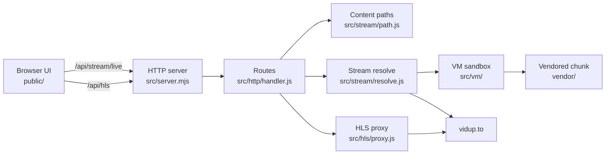

# VidUP Stream Resolver

Node.js **HLS stream resolver** for [vidup.to](https://vidup.to). Maps movie and TV content IDs to title paths, extracts page tokens, decodes stream hosts inside a **VM sandbox** from VidUP client logic, and serves proxied **m3u8** playback through a local **HTTP API**. Zero npm runtime dependencies — **ESM** on Node.js built-ins only.

## How the stream resolver works

- Builds `/movie/{id}` and `/tv/{id}/{season}/{episode}` paths from a TMDB-style numeric ID
- Fetches the VidUP title page and extracts the `en` token from embedded page data
- Loads a vendored webpack chunk and runs the same decode path the site uses in a **server-side** **JavaScript** sandbox
- Resolves obfuscated API path segments through a static string decoder extracted from the client bundle
- Lists available stream hosts from the VM, then **probes servers in parallel** and races decode until the first playable **HLS** URL is ready
- Rewrites **m3u8** manifests and forwards segments through `/api/hls` with required referer headers; unwraps PNG-wrapped transport segments when present
- Ships a small browser UI with live SSE progress, hls.js playback, server chips, and a copyable proxied link

## Quick start

```bash
git clone https://github.com/sharoon7171/vidup-stream-solver.git
cd vidup-stream-solver
npm start
```

Open `http://127.0.0.1:8787`, enter a TMDB ID, choose movie or TV (season/episode when needed), and click **Play**.

Requires Node.js 18+ (native `fetch`). Runs as a local **HTTP server** on port `8787` by default (`PORT` env override).

## Content paths

| Type  | Path |
| ----- | ---- |
| Movie | `/movie/{id}` |
| TV    | `/tv/{id}/{season}/{episode}` |

`{id}` is the numeric TMDB ID used in VidUP URLs (same number on [themoviedb.org](https://www.themoviedb.org)).

## Environment

| Variable | Default | Purpose |
| -------- | ------- | ------- |
| `PORT` | `8787` | HTTP listen port |
| `VIDUP_ORIGIN` | `https://vidup.to` | Site origin for page and stream requests |
| `VIDUP_CSRF_TOKEN` | site default | `X-Csrf-Token` header for upstream POSTs |

## Streaming API

All routes are served from the root HTTP server. JSON responses use `ok: true` on success or `ok: false` with `stage` and `error` on failure.

### `GET /api/stream`

Resolve content to the first playable stream (blocks until probe/decode completes).

| Param | Required | Description |
| --- | --- | --- |
| `id` | yes | TMDB numeric ID |
| `type` | no | `movie` or `tv` (inferred from season/episode when omitted) |
| `season` | TV only | Season number |
| `episode` | TV only | Episode number |
| `server` | no | Server index or name to prefer during probe |

**Example**

```
GET /api/stream?id=533535&type=movie
```

**Success**

```json
{
  "ok": true,
  "type": "movie",
  "contentPath": "/movie/533535",
  "streamUrl": "https://…/master.m3u8",
  "selectedServer": { "index": 0, "name": "ServerName" },
  "servers": [{ "name": "…", "description": "…", "image": "…", "data": "…" }]
}
```

### `GET /api/stream/live`

Same query params as `/api/stream`, but streams progress over **Server-Sent Events**:

| Event | Payload |
| --- | --- |
| `status` | `{ step, text }` — current pipeline step |
| `found` | Server that passed upstream probe |
| `ready` | First decoded `streamUrl` plus server list |
| `fail` | `{ ok: false, stage, error, … }` |
| `done` | Final server list after all probes finish |

The bundled UI connects here for step-by-step feedback and starts playback on the first `ready` event.

### `POST /api/server`

Decode a specific server slug when you already have `contentPath` and `data` from a prior resolve.

```json
{
  "contentPath": "/movie/533535",
  "type": "movie",
  "data": "server-slug-from-vm"
}
```

Returns the same shape as `/api/stream` for a single host.

### `GET /api/hls?url={streamUrl}`

**Manifest proxy** for HLS playback. Playlists are rewritten so relative segment and key URLs loop back through this endpoint. Binary segments are fetched with VidUP referer headers; PNG-wrapped MPEG-TS payloads are stripped to raw `0x47` sync.

Proxied playback URL:

```
http://127.0.0.1:8787/api/hls?url={encoded_streamUrl}
```

## Architecture



### Resolve flow

1. **Content resolution** — `src/stream/path.js` maps TMDB ID + type into a VidUP title path; obfuscated stream POST paths come from `vendor/extracts/decoder.js`
2. **Token extraction** — title page HTML is fetched; the `en` token is parsed from embedded JSON
3. **VM load** — `src/vm/extract.js` slices the VidUP webpack chunk; `src/vm/runtime.js` builds a sandbox with fetch, crypto, and DOM shims, then exposes `runServers` and `runDecode`
4. **Server list** — VM runs against the page token and returns named hosts with opaque `data` slugs
5. **Parallel probe** — workers POST each slug upstream; reachable hosts are emitted as they are found
6. **Stream decode** — VM decodes the upstream response body into an HLS master or media playlist URL
7. **Playback** — browser plays through `/api/hls` so manifests and segments carry the headers the CDN expects

## Project layout

```
src/server.mjs             HTTP entry
public/
  index.html               local player and resolve UI
src/
  cfg/constants.js         origin, user-agent, CSRF headers
  http/handler.js          route dispatcher
  stream/
    path.js                content path builder and query parser
    resolve.js             probe, decode, SSE live resolve
  hls/proxy.js             m3u8 rewrite and segment proxy
  vm/
    runtime.js             sandbox construction and VM invoke
    extract.js             chunk slice, patches, runner glue
vendor/
  chunks/294-….js          vendored VidUP client chunk
  extracts/decoder.js      static string table decoder
```

## Reverse-engineering notes

VidUP ships stream discovery and **stream decode** inside a numbered webpack bundle rather than plain REST handlers. This repository vendors that chunk, extracts the VM region, and replays the same `oz` / `oP` entry points the browser calls after **token extraction**. When VidUP updates their client, refresh `vendor/chunks/` and re-run the extract step against the new bundle boundaries in `src/vm/extract.js`.
